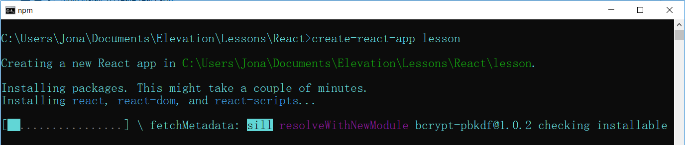

To start a new react project we will use **npm** to do a lot of the heavy lifting for us. To that end, we're going to npx (a package runner tool that comes with npm), the **create-react-app** command, and define the name of our project.

  

    npx create-react-app lesson

  

This might take a while to run. You might have to hit 'Enter' if the loading gets stuck.

