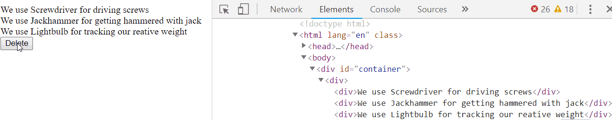

React comes with what's known as a [**Virtual DOM**](https://reactjs.org/docs/faq-internals.html) - they did not invent this concept, but in short: the Virtual DOM is a copy of our _actual_ DOM. But instead of being a tree of HTML nodes, the virtual DOM is **purely a normal JS object**.

  

Using the **Virtual DOM**, React does the following:

  

-   Once an event happens, and triggers a render (that mean calling the render function, for a specific component and all it's sub tree) React will build a new version of the _Virtual_ DOM
-   Compare the Virtual DOM's current and latest versions
-   In the comparison, React will look for differences
-   When it finds a difference, it will update the actual DOM in that _one_ location

  

This may seem like a lot, but ultimately **it is much easier and faster to work with objects than to render the DOM**.

  

So even though React does some behind-the-scenes work before updating the DOM, it eventually only has to update the relevant element(s) in the DOM.

  

Here's how the same re-render from before looks in React:

Notice that only one `div` is physically affected when we delete an element.

  

To boil down one of the reasons React is faster, remember this:

**Rendering the DOM is expensive**, whereas manipulating objects is (generally) much cheaper. **React renders less** and manipulates objects more using the Virtual DOM.

  

Sure, there are other frameworks that do other things; some better, some worse. But once you learn one framework, picking up another tends to be relatively straightforward, so no need to worry about "only" learning React ;)

  

So with that out of the way, let's get Reacting.
