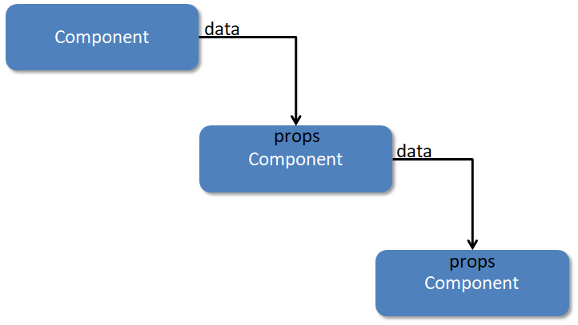

Knowing how to pass things from a parent to a child is fundamental to React.

  

This is known as a **top-down** approach to **data flow**, and one of the benefits is that **children components are not aware of their parents** - this allows us to reuse them anywhere so long as they receive the data (props) they need.

  

You can think of this concept visually, like this:

  

  

The data always goes from the parent into the children's `props`, then those children might pass those `props` down as data to _their_ children, and so on.