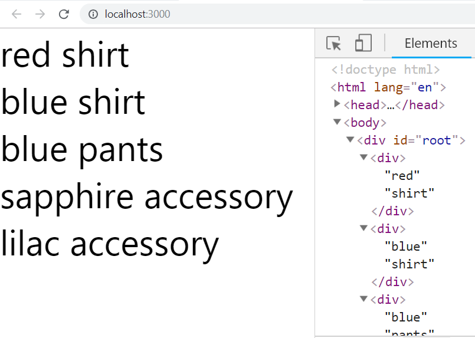

Add some code to the following two components in the components folder:

-   `Wardrobe`
-   `Article`

  

The `Wardrobe` component should take each item in the array below and pass each object as props to the the `Article` component who will render them in a `div`.

  

Use `App` to render `Wardrobe`

  
```
let wardrobe = [
  { type: "shirt", color: "red", size: "Medium" },
  { type: "shirt", color: "blue", size: "Medium" },
  { type: "pants", color: "blue", size: "Medium" },
  { type: "accessory", color: "sapphire", size: "" },
  { type: "accessory", color: "lilac", size: "" }
]
```
  

Your page should look like something like this (with **no warnings**):

  



---


<details>
  <summary>
     Solution
  </summary>

```JSX

const Article = (props) => {
  return <div>{props.info.color} {props.info.type}</div>
}

const Wardrobe = () => {
  let wardrobe = [
    { type: "shirt", color: "red", size: "Medium" },
    { type: "shirt", color: "blue", size: "Medium" },
    { type: "pants", color: "blue", size: "Medium" },
    { type: "accessory", color: "sapphire", size: "" },
    { type: "accessory", color: "lilac", size: "" },
  ]

  return wardrobe.map(c => <Article info={c} key={c.color + c.type} />)
}

const App = () => {
  return <Wardrobe />
}

export default App;

```


</details>