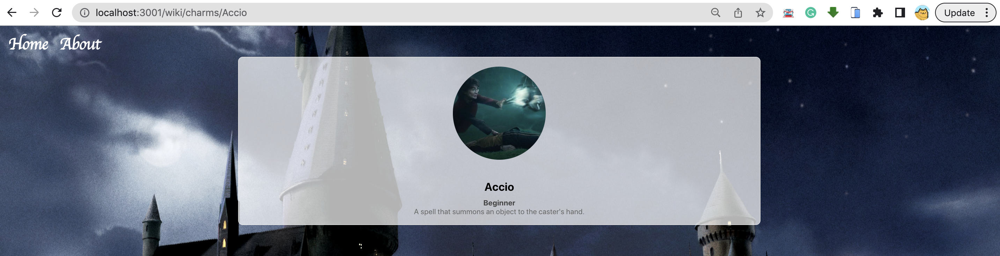

#### **SETUP**

  

To learn about React routes, we're going to create a directory. Like a phone directory.

  

Since directories are a little... antiquated, we're going to make a harry potter themed lesson!

Ultimately, our directory will look something like 

  

It's a desciprition of a charm!.
make sure to **pay attention to the route** on top - see how it matches up with each page. For example, when the route is `http://localhost:3001/wiki/charms/Accio` - we're on the page with all the details about the charm Accio.

So for now, to save you the boring stuff, **go ahead and fork & clone** [**this repo**](https://github.com/Elevationacademy/hogwart-template) - part of this lesson will be a code-along that sets up the final exercises - so you must **complete the code throughout the lesson**.

  

  **Note:** if you decide to clone it into your `projects/exercises` folder, don't forget to kick out our `.git` file. We don't want it crashing the party - it's got a twin sibling in there already! 🎉👯‍♂️😄

  ---

  

Look around the repo a bit, get a feel for what you already have set up, and let's dig in.

  

***

  

Specifically, **take a look at** **package.json** - notice the new **react-router-dom** **package in the** **dependencies** **section**.

  

If you create your own project, you'll have to `npm install react-router-dom` (on top of the normal react stuff), but now **you can just** **npm install** as usual.

  

Once everything is installed, **npm start** **as always**, then see a pretty image in the background with... nothing else. Let's change that.