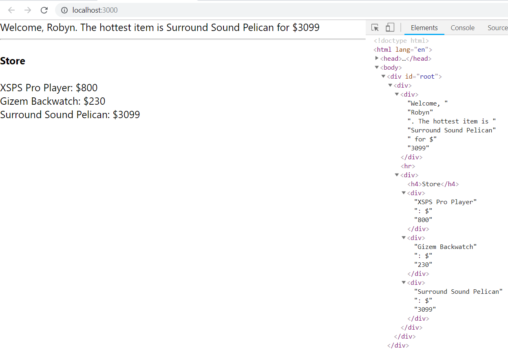

## Exercise 1

Create a component called `Hudini` in your components folder).
Your `App` component should render this.

  

Inside of `Hudini`'s `state`, define a single property: `show`, with an initial value of `false`

  

Inside of `Hudini`'s `render`, you should display a single `div` with a message of _either_ "Now you see me", _or_ "Now you don't", depending on the state of `show`

  

Use the [React Developer Extension](https://chrome.google.com/webstore/detail/react-developer-tools/fmkadmapgofadopljbjfkapdkoienihi?hl=en) to test your work - change `show`'s value to `true`, and you should see "Now you see me".

  

**Bonus:** `Hudini`'s render should be a single line (using a ternary statement).

Now add a button that will change the Hudini's state.

## Exercise 2

Create the following component tree:

-   `App`
    -   `Landing`
    -   `Home`
        -   `Item` (many)

  

Inside of `App`'s `state` you should have the following data:

  
```
  {
    user: "Robyn",
    store: [
      { item: "XSPS Pro Player", price: 800, discount: 0.2, hottest: false },
      { item: "Gizem Backwatch", price: 230, discount: 0.6, hottest: false },
      { item: "Surround Sound Pelican", price: 3099, discount: 0.05, hottest: true }
    ],
    shouldDiscount: false,
    currentPage: "Landing"
  }
```
  

**Home & Item**

-   `App` should pass the entire `store` data to `Home`
-   Then, `Home` should use this data to render instances of `Item`
-   Finally, each `Item` should render the `item` and `price` it has received from `props`

  

**Landing**

-   In the `Landing` component you should display a `div` with a "Welcome, Robyn" message
-   This should use the `user` property from `App`'s `state`
-   This `div` should also show the hottest item in the store with the welcome message.

  

For now, this exercise should look something like this:

  



  

  

Click [here](.guides/img/exercise-2.png) to emibggen.

## Exercise 3
Continuing with the previous exercise, you should display either the `Landing` component, or the `Home` component depending on the string in the `currentPage` - the property inside of `App`'s `state`


Add buttons to switch between the pages.

## Exercise 4

Now you'll use the `shouldDiscount` property in `App`'s `state` to determine whether to discount the items.

  

If `shouldDiscount` is `true`, you should display `price * (1 - discount)` of the original price - this should only happen in the `Home`/`Item` component, not the `Landing`

  

**Note**: you can change the price in `Home` or in `Item`, but it should be based off the `shouldDiscount` key in `App`'s `state`