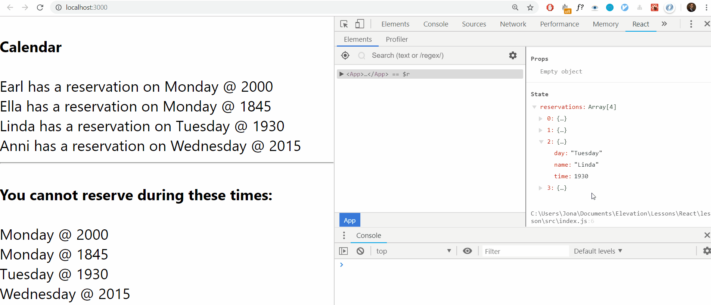

The reason we call `state` "state" is because it should represent the *state* of our component (and possibly its children).

  

In fact, we often **use** **state** **to manage data between separate components that share a parent**.

  

For instance, say we had a Restaurant app. This app has two main sections: `Calendar` and `Register` - clearly, both of these will require the same data: the `reservations` data.

  

The first component, `Calendar`, needs the data in order to display it on a calendar.

  

The second component, `Register`, needs the data in order to prevent users from making a reservation at a time that's already taken.

  

Take a look at this code:

  
```
import React, { useState } from 'react';

function Calendar() {
  return (
    <div id="calendar">
      {/* your code here */}
    </div>
  )
}

function Register() {
  return (<div id="register">
    {/* your code here */}
  </div>)
}

const App = () => {
    const [reservations, setReservations] = useState([
        { day: "Monday", time: 2000, name: "Earl" },
        { day: "Monday", time: 1845, name: "Ella" },
        { day: "Tuesday", time: 1930, name: "Linda" },
        { day: "Wednesday", time: 2015, name: "Anni" }
    ]);

    return (
        <div>
            <Calendar reservations={reservations} />
            <Register reservations={reservations} />
        </div>
    )
}

export default App;

```
  

In the above, both `Calendar` and `Register` are receiving the same data. Thus `App`'s `state` is our **single source of truth** for these two components.

  

**Important**: any data that we render should come from `state` - that way any time we update `state`, React will automatically update our DOM for us.

  

We can see that in action in the following visual, where we use the [React Dev Tools Chrome Extension](https://chrome.google.com/webstore/detail/react-developer-tools/fmkadmapgofadopljbjfkapdkoienihi?hl=en) to change the `state` manually:

  



  

  

Click [here](.guides/img/lesson-15.gif) to embiggen.

  

Notice that **just by changing** **state****, our DOM has updated** everywhere that uses data from `state` - we don't call any method, we don't clear the DOM; nothing. React handles everything for us.


-   State allows us to have **one source of truth** for our data
  -   We have _one_ place where we store our information, and everyone who needs access to it will get it from there

  

-   State helps us keep our **top-down** approach to data flow
-   The data will always flow down from the state in the parent to (the props in) the children

  

-   State allows us to seamlessly update the DOM by _only_ changing data in the state