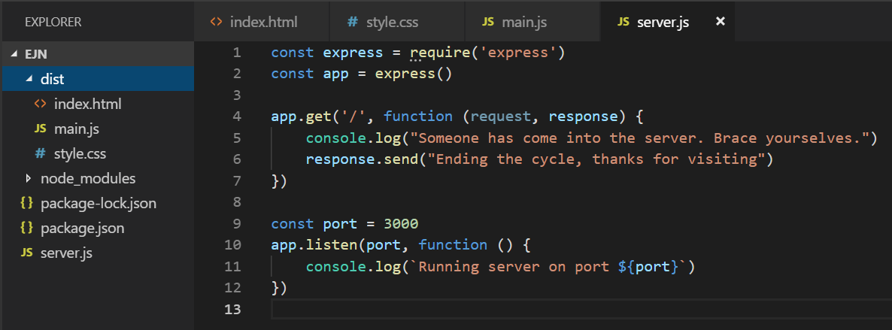

So far our routes have been serving nothing more than simple strings and objects. This is important, because we want our servers to serve data - but we promised that servers could also serve files.


To show how this works, go ahead and create a folder called `dist`, and inside of it add three files: `index.html`, `style.css`, and `main.js`


Your setup should now look like this:




Click [here](https://s3-us-west-2.amazonaws.com/learn-app/lesson-images/express-ejn-starter-setup.PNG) to embiggen.

  

We've left only the **root route** for simplicity, but that's how it should look more or less.

  

The `dist` folder is a directory that our server will **serve** to whoever asks. The name `dist` is just a convention that stands for `distribution` - other developers will call this folder `client`, `build`, or `public` - they're all fine choices.

  

Add some basic starter code to your client files.

Add this to your HTML file:
```
<!DOCTYPE html>
<html>

<head><meta charset="utf-8" /><meta http-equiv="X-UA-Compatible" content="IE=edge"><title>Totally Real Site</title><link rel="stylesheet" type="text/css" media="screen" href="style.css" />
</head>

<body>
<div onclick=changeColor(this)></div><script src="main.js"></script>
</body>

</html>
```
  

Add this to your CSS file:
```
div{
    width: 100px;
    height: 100px;
    background-color: #e67e22;
    box-shadow: 1px 1px 3px black;
}
```  

Add this to your JS file:
```
const changeColor = function (div) {
    div.style.backgroundColor = "#3498db"
}
```
  

And now, to serve them, add the following lines to your `server.js` file:
```
const path = require('path')
```
  

Add this below your `require('express')`` import - there's no need to install this module; `path` is a built-in to node.

  

We'll see in a second what `path` is for. Next, add this **before your root route**:
```
app.use(express.static(path.join(__dirname, 'dist')))
```
  

Alright, let's break this down:

-   The `use` method allows us to configure **middleware** - we'll talk about this in a separate lesson
-   Briefly, we're just saying "use this code before going to the routes"
-   The `express.static` part is what allows us to serve static files (our client files are static for now: they stay the same)
-   The `path.join` creates a directory path for us - we're telling the server where the files we want to serve are
-   ``'dist'``, of course, is the name of the directory with our client files

  

If you console log (just before the ``app.use...`` section) the following:

-   `__dirname`
-   ``path.join(__dirname, 'dist')``

  

You'll see exactly the path that's being created for us, and what the job of `path.join` is.

  

And **now, save your file, restart your server, and go to** [**localhost:3000/**](http://localhost:3000/) - and voila, your first served application.

  

Again, try using [Ngrok](https://ngrok.com/) and have someone else access your app to see it work across the internet.

  

----------

  

This, therefore, is one of the most basic servers you can create to serve a web application:
```
const express = require('express')
const path = require('path')
const app = express()

app.use(express.static(path.join(__dirname, 'dist')))

const port = 3000
app.listen(port, function () {
    console.log(`Running server on port ${port}`)
})
```
  

Notice that to serve a simple bundle of files, we don't even need any routes!

Generally, **we use routes to serve data**, and it's enough to to use **express.static to serve files/directories**.

  

**Spot check:** with this knowledge, go back to one of your old projects and serve it using `express` - when you go to localhost:3000/ you should see your entire app! Don't forget to move all your client files to your ``/dist`` folder.

  

Maybe [Ngrok](https://ngrok.com/) to show off the old project to someone..?