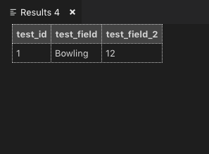
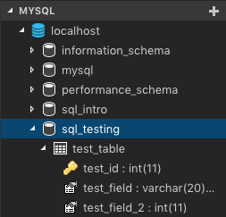

To make sure you're all set, **right click the** **`localhost`** **icon and press** **`New Query`**

  

A new file should have opened up. Go ahead and copy paste the following SQL commands- don't worry, we'll explain everything soon. This is just for testing:

```
USE sql_testing;

CREATE TABLE test_table(
    test_id INT NOT NULL AUTO_INCREMENT,
    test_field VARCHAR(20),
    test_field_2 INT,
    PRIMARY KEY (test_id)
);

INSERT INTO test_table VALUES(null, "Bowling", 12);
SELECT * FROM test_table;
```
  

Run this code by either **right-click -> Run MySQL Query** or whatever shortcut it suggests. On Windows it's **Ctrl + Alt + E**. On Mac it's **Ctrl + option + E**

  

If you have problems running those lines, make sure to copy-paste by selecting the text, and not by clicking on the `copy` button.

  

If all is truly well, you should see this screen pop up on the right of your VS Code:

  



  

And you should be able to **right-click, refresh** the `localhost` icon and see the following under the **MYSQL** tab:

  



  

----------

  

  

#### **DONE;**

  

Great, now you're ready to learn SQL.