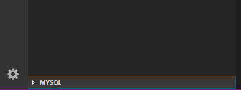
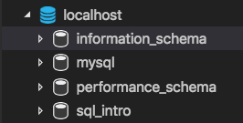

Start by installing [this extension](https://marketplace.visualstudio.com/items?itemName=formulahendry.vscode-mysql).

  

Once it's installed and you've restarted/reset your VS Code, you should see this at the bottom of your editor:

  

  

If you press that you'll see a plus (+) sign appear on the right - press that and at the top of your editor you'll be prompted for some info to connect to the server we created earlier.

  

To connect to the server, go ahead and **use the following connection parameters**:

-   **hostname:** `localhost`
-   **user:** `root`
-   **password:** (nothing - just press enter, unless you entered password in the mysql setup)
-   **port:** 3306 (should be the default)

  

You can **ignore the next option** that pops up (just press Enter)

  

The `localhost` server should pop up under the mysql section, and if you open it, it should look something like this:

  

  

You can safely ignore the `information_schema` and other DBs automatically added. The only important one for you right now is the `sql_intro`.