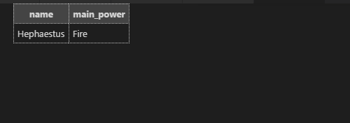

The sharp-eyed will note that even though the "mythology" data for our Grecian deities was "Greek", we searched a lowercase "greek" and it still found results. That is because **MySQL is case insensitive by default** - and that's fine.

  

Case sensitivity is not a major concern of relational databases (generally), but other DBs like [Elasticsearch](https://www.elastic.co/) handle it very well. If you want to look into case sensitivity for MySQL, here are the [docs](https://dev.mysql.com/doc/refman/8.0/en/case-sensitivity.html)

  

  

----------

  

So one of the great things about databases is that they remember everything for us.

You remember that Greek deity whose name starts with "Hep..." something? Ah come on, what was it? SQL, help!

  
```
SELECT name, main_power
FROM Deity
WHERE name LIKE 'hep%';
```



  

Assuming you added Hephaestus to your db (why wouldn't you), you should see these results. If you didn't, you can add her into your DB now and give it a shot.

  

That's the one! God of blacksmiths and fire.