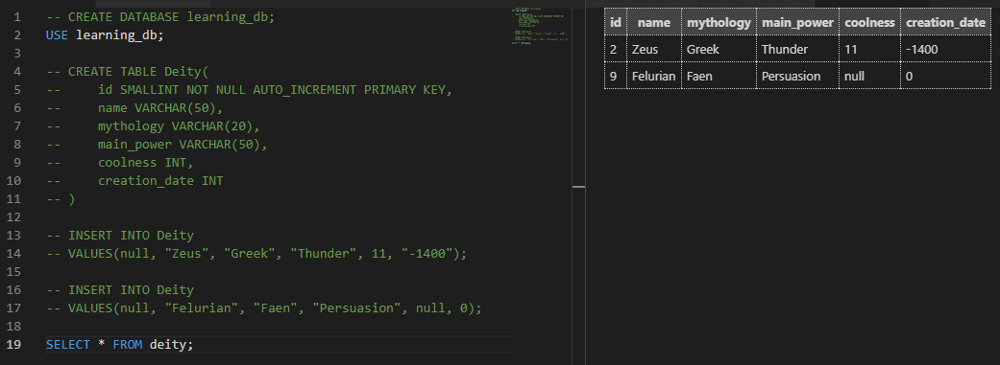

Now we want to extract the data back and read it. The basic command for selecting our data - and hopefully you aren't faint of heart because this one is a real shocker:

  

`SELECT...FROM TABLE_NAME`

  

The easiest way is to just select _all_ our data using the special asterisk ( * ) symbol, like so:


```
SELECT * FROM Deity
```
  

This should open up a split-window view in your editor and display all data in your table:

  



  

Of course, we don't always want _all_ our data - we could have dozens of columns in there.