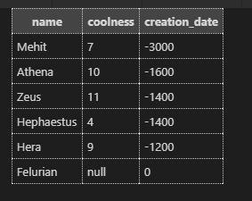

For this query, make sure you write your code in the `check_5.sql` file.

  

----------

  

Write a query that returns the name, coolness, and creation date of your deities. Order it first by creation date, then by decreasing coolness.

  

See [this codepen](https://codepen.io/ElevationPen/pen/qGRPWa?editors=0010) for a solution.

  

Your resulting table should look like this:

  

Notice that Zeus is before Hephaestus because he is cooler.