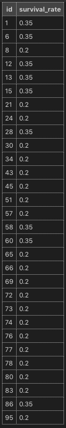

## Exercise 1

The following UMLs show a database setup that tracks patients in a hospital.
    
The patients are either healthy, or suffer from one of two disease: "Lettuce disease" or "Cabbage disease".
    
Each disease generally affects one ethnicity more than others, and one gender more than the other. Both diseases also have their own set of common symptoms.
    
Inside of `/solutions/ex_1.sql`, **create the following tables, with the notes below**:
    

    
Click [here](https://s3-us-west-2.amazonaws.com/learn-app/lesson-images/dbs/sql/relationship-exercise-uml.PNG) to embiggen.
    
      
**Notes** on the UML:
    
-   The **only** auto-incrementing PK should be in the `patient` table
-   Make sure all your casing and underscores match the above UML precisely
-   Any arrow suggests a **Foreign Key** relationship
    -   For instance, the arrow between `ethnicity` in the `patient` table and `id` in the `ethnicity` table suggests that `ethnicity` in `patient` should be a `FOREIGN KEY`
-   Any golden key suggests that field should be a `PRIMARY KEY` for that table
    
    ----------
    
      
    
    Once your tables are set up, **use** [**this repo**](https://github.com/Elevationacademy/sql-relationship-inserts) **to get a bunch of** **`INSERT`** **commands** you can use to load your data (you'll need this for the subsequent exercises). ****** After `INSERT`ing all of the data please comment out the `INSERT`s and uncomment out the `CREATE TABLE`s so that we can test your code properly.******
    
    
    
## Exercise 2

Read the [documentation for the](https://dev.mysql.com/doc/refman/8.0/en/counting-rows.html) [COUNT](https://dev.mysql.com/doc/refman/8.0/en/counting-rows.html) [command](https://dev.mysql.com/doc/refman/8.0/en/counting-rows.html).
    
Inside of `/solutions/ex_2.sql` write a query that determines how many patients are sick.
    
**Hint:** [this](https://www.techonthenet.com/sql/is_not_null.php) might help.
    
If you did it right, you should find that there are 30 sick patients.
    
 
## Exercise 3

Determine how many people are suffering from the cabbage disease.
    
If you did it right, you should find that there are 21 patients with the cabbage disease.
    
Write this query inside of `/solutions/ex_3.sql`.
    

    
## Exercise 4

Query for the survival rate of all the sick patients, and display them in ascending order of ID.
    

Write this query inside of `/solutions/ex_4.sql`.
    
      
    
If you did it right, your results should look [like this](https://s3-us-west-2.amazonaws.com/learn-app/lesson-images/dbs/sql/relationship-exercise-survival-result.PNG).
    
Or this:
    

    

    
## Exercise 5

Read the [documentation for the](https://dev.mysql.com/doc/refman/8.0/en/group-by-modifiers.html) [GROUP BY](https://dev.mysql.com/doc/refman/8.0/en/group-by-modifiers.html) [command](https://dev.mysql.com/doc/refman/8.0/en/group-by-modifiers.html).
    
      
    
Inside of `/solutions/ex_5.sql` write a query that determines how many patients have the cabbage disease, _per_ _`symptoms_family`_
    
      
    
If you did it right, your results should look like this:
    

    
      
    
**Hint:** The `COUNT` command will be useful.
    
      
    
**Hint 2:** See [this stack overflow answer](https://stackoverflow.com/a/2436957).
    
  
  
## Exercise 6
    
Write a query that determines how many patients have the lettuce disease, _per_ _`ethnicity`_
    

If you did it right, your results should look like this:
    

    
          
Write this query inside of `/solutions/ex_6.sql`.