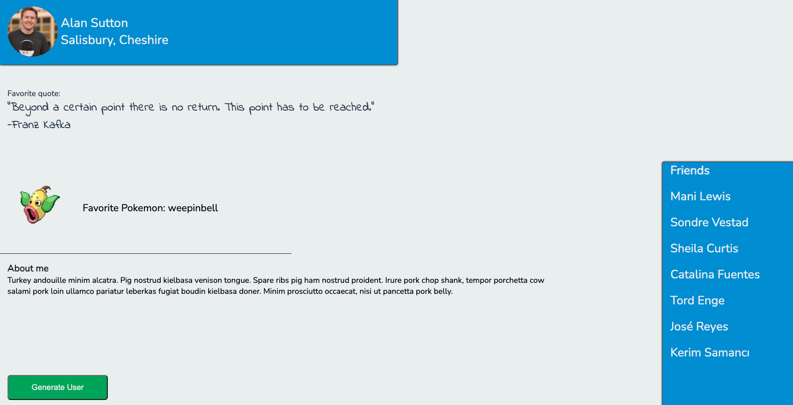

Ultimately, your page will end up looking more or less like this:

[Click here to view the **image** ](https://ibb.co/5Wnf4fC)

---

Plain and simple, but **all** the data comes from APIs - you will be writing virtually no text!

  

There are four **API**s you'll need to use in order to accomplish this project:

  

-   [**Random User Generator API**](https://randomuser.me/documentation#format)
    -   This API returns an array of User objects which a bunch of data on each user
    -   You'll need to request 7 random people from this API
    -   The first will be your main user (the top section on the page), the next 6 will go in your "Friends" section
        -   From your main user you'll need a picture, a first name & last name, the city and state.
        -   From your other 6 users, you'll just the need first and last name
        -   Reference the image above to see how you should properly render this data

---
-   [**Random Kanye Quote Generator API**](https://kanye.rest/)
    -   This API returns a random quote from Kanye West
    -   You'll need the quote (the author is always Kanye)
---
-   [**PokeAPI**](https://pokeapi.co/docs/v2)
    -   This API is for querying all things pokemon - from cities in the poke-verse, to different berries, and the pokemon themselves
    -   You'll need to query for a random Pokemon from this API.
        -   From the pokemon object you'll need an image of the pokemon, and the name of the pokemon.
    -   _Hint/Fun Fact: there are currently 949 Pokemon recorded (but we know who the cool ones are...)_
    -   _Another Hint: Sprites are commonly known as images or computer graphics_
---
-   [**Bacon Ipsum API**](https://baconipsum.com/json-api/)
    -   This API returns random text, like a [Lorem Ipsum](https://www.lipsum.com/) text generator, but it's text about Meat. Mmm. Tasty.
    -   This is the text you will use for the "About Me" section at the bottom