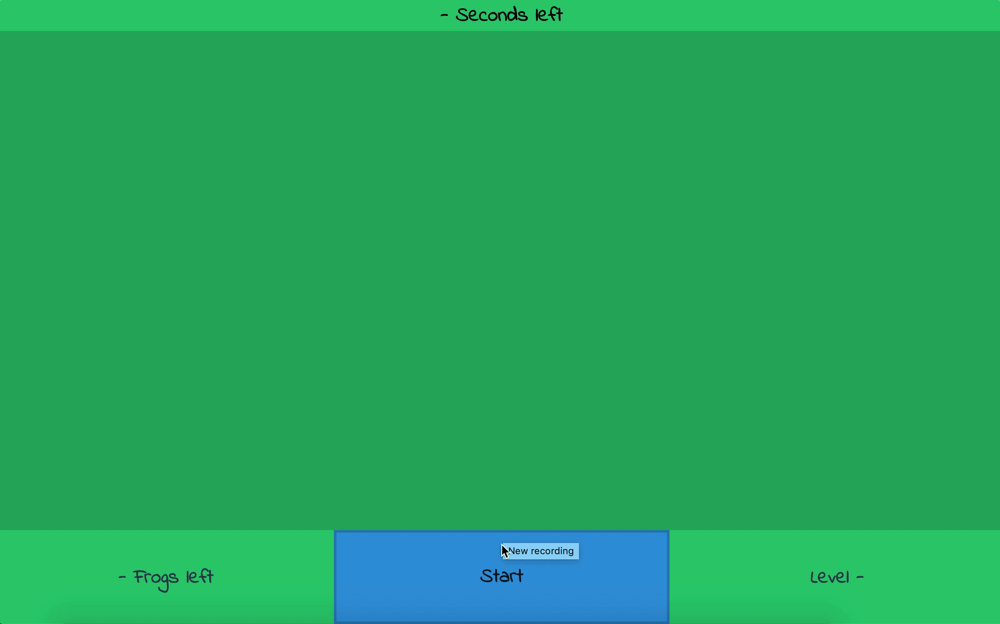

# Intro

Let's recap the things we've learned so far:

  

-   HTML + CSS
-   Grid
-   JS
	-   Basics
	-   Callbacks
	-   Arrow functions
	-   `this`
-   DOM
-   jQuery
	-   DOM Traversal
-   Data Flow

  

And you've got experience on at least a couple of projects (Tweeter, Form, Ball Game) - that's quite a lot of coding!

  

Today you're going to work on another project - and you're going to make it entirely on your own, from scratch, using the tools you know.

  

The inspiration for this game is from [this entertaining clip](https://www.youtube.com/watch?v=HywwY2Az5bQ), and you've got instructions below. Good luck!