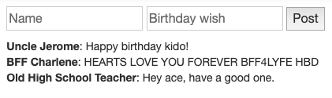

## Recap Exercise

You'll get to practice MVC more later, but for now - **without looking at the code bits spread throughout this lesson** (the timeline example) - complete the following:

  

-   Create a simple pair of inputs and a submit button in your HTML
-   The inputs are name and text
-   Create a posts array with a few {name: ..., text:...} objects
-   Write a function called render that loops through posts and creates a simple div for each post
-   The loop should also add the div to somewhere on the HTML
-   Add an on("click") event to the button. When the button is clicked you should:
    -   Grab the name and text from the inputs
    -   Push a new object to the posts array with the name and text data
    -   Call render again

  

Once you're done with that, you'll notice that whenever you add a new post, it will duplicate the entire list on the DOM - fix this.

[This](https://api.jquery.com/empty/) might be useful

  

Ultimately, it should look something like this (no need to spend time on too much CSS):›

## Extension

This will be a little hard to do with the tools you have now, but if you want a challenge: write some code that removes a post when you click on it. Again, you should **remove it from the** **posts** **array**, then re-render.

  

----------

  

#### **DONE**

  

The rules of data flow are super important, and they go hand-in-hand with our work on modules.

Modules, data-flow, and other concepts we'll learn in the future all have to do with [**separation of concerns**](https://en.wikipedia.org/wiki/Separation_of_concerns), a core concept in programming.

So welcome to the world of separated concerns!