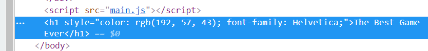

Sometimes we want to _dynamically_ create elements, then add them to the DOM. This requires a few steps:

1.  Create the element
2.  Add things to the element (text, attributes, etc)
3.  Add the element to the page

Here is a simple example:
```js
const header = document.createElement("h1")
header.innerHTML = "The Best Game Ever"
header.style.color = "#c0392b"
header.style.fontFamily = "Helvetica"
document.body.appendChild(header)
```

-   Line 1: create an `h1` element using `document`'s `createElement` method
-   Line 2: give the header some text using `innerHTML` - note that we're adding the text to the element itself!
-   Line 3-4: style the element using `style` again
-   Line 5: Actually add the element to the page using `document`'s `appendChild`* method
-   Specifically, add it to the `body` - which is an element in our HTML!
-   We could add it to any element on the page, of course, which we would do regularly: `document.getElementById("...").appendChild(header)`

###### *What does **append child** mean? Remember, the DOM is just an object - so we are literally adding a _child_ to the `body`!

 
Now when you refresh you should see the new header at the top of your page! In fact, you should see it when you inspect the page, too:
  




Notice that when you `appendChild`, it does so the to _end_ of the element - so watch out for that*

###### *In this case all our other elements are absolutely positioned, so it doesn't really matter


----------
 
Another neat thing: instead of adding a bunch `.style`... lines, we can use `document` to set attributes to our element, like this:

  
```js
header.setAttribute("class", "my-header")
```
  

The above adds a `class` called `my-header` to the attribute we just created. If we did this just with HTML, it would be the equivalent of writing this:


```html
<h1 class="my-header"></h1>
```
  

You can, of course, add any attribute you want: `id`, `href`, `src` - any!
