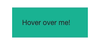

Now for the fun stuff. We're going to do things like this:

  



##### **(This example is not related to the game-code from before)**

  

An **event** is something the user _does_ - a physical action, like click on an element, or hover over one. We want to "listen" to those events, and react accordingly.

  

In the little box above, we're listening to two events: the mouse entering the box, and the mouse leaving it. Each event **triggers** some change (color and text) - and without further ado, here is the code for the above:

  

**JS** - nothing new here

```js
const box = document.getElementById("box")

const enterColor = function () {
    box.style.backgroundColor = "#c0392b"
    box.innerHTML = "AHH GO AWAY"
}

const leaveColor = function () {
    box.style.backgroundColor = "#1abc9c"
    box.innerHTML = "Hover over me!"
}
```
  

...but who calls these functions?

  

**CSS** - same old CSS

  


```css
#box{
  background-color: #1abc9c;
  line-height:20px;
  text-align:middle;
  width: 150px;
  padding: 20px;
}
```
  

**HTML** - here's the good stuff


```html
<div id="box" onmouseenter="enterColor()" onmouseleave="leaveColor()">Hover over me!</div>
```
  

New attributes! These attributes are our **events** - they invoke our JS functions!

  

Both attributes act exactly the way you expect. When the user hovers the mouse over the `div`, i.e. when the _mouse enters_ the element, the `enterColor( )` function will be called!

  

This is exactly the **event** we're looking for! The event `onmouseleave` works similarly.

  

There are [many events](https://developer.mozilla.org/en-US/docs/Web/Events) to play with.
