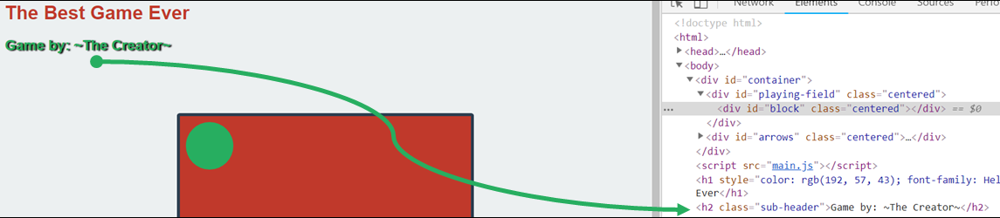

Now you try. **Create another header using JS**

-   This time an `h2`
-   Store this header in a variable called `subHeader`
-   Give the header some text
-   Give the header a class
-   Style the class in your CSS file
-   Revel at your glorious work

  

  

Take a crack at this, and check [here](https://codepen.io/ElevationPen/pen/qGwxMm?editors=0110) once you've tried.
