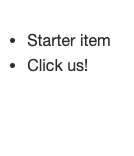

Create a simple list (you can do this in a separate file, or on [codepen](https://codepen.io/pen)) with some items. When you click on any part of the list, it should add another item, like this:

  

If you're stuck, check out [this solution](https://codepen.io/ElevationPen/pen/Pvgeap?editors=1010) on codepen.
