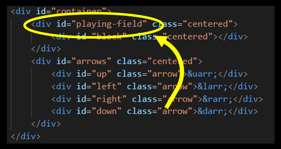
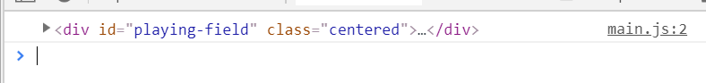

In the example from earlier, we used the following code to **target**, i.e. _find_ an element we were interested in:  

```js

document.getElementById("playing-field")
``` 

The `document` is the same object we talked about before. One of the nice things this object gives us is several **methods** - functions - to access and manipulate the DOM.

In the above code, we're using the `.getElementById` method - which does exactly what it says: find an element in the DOM that has a certain ID. In this case, `playing-field`

Look back at the HTML:



Yes, JS is referencing the _same ID_ we defined in our HTML.

Now that we've _targeted_ the element, we can store it in a variable, like so:
```js
const playingField = document.getElementById("playing-field")
```
Go ahead and do that in your `main.js` file, then `console.log(playingField)` and look at the console in the browser.

Uh oh. It is `null`.

The reason has to do with how the browser is reading our files. Look at this code from `index.html`:
```html
<head>
  <title>DOM</title>
  <link rel="stylesheet" href="style.css" />
  <script src="main.js"></script>
</head>
  
<body>
  <div id="container">
  <!--etc...-->
```  

Notice how we have our `script` _before our actual HTML content_?

Since the browser is reading one line at a time, it will first load and run all of our JS code, and only then read and render the HTML - that means that when we do `document.getElementBy("...")` - it won't work, because `playing-field` is not on the page yet!

The fix is to bring the `script` tag all the way down, just before the closing `/body` tag

Now save and refresh your page, and your console should look like this:


See that? As promised, we're accessing HTML through our JS. We now have, in our `playingField` variable, an HTML node that represents exactly that `div`. Sweet.
