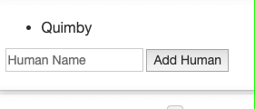
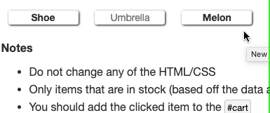
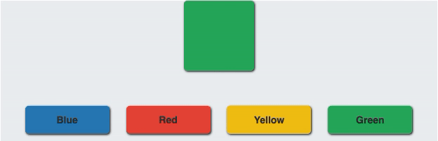

## Exercise 1
Recreate the following:


You can create the initial ul and the first li in your HTML - but everything else is jQuery.

## Exercise 2
Add some code to Exercise 1 that lets your remove a human that you click on - use this and dynamic event listeners.

## Exercise 3

Given the following CSS:
```
.box{
    width: 70px;
    height: 70px;
    margin: 10px;
    background-color: #8e44ad;
    display: inline-block;
  }
```
  

Create the following using **only** JS (jQuery, of course) - there should be nothing in your HTML body


  

Hover over the boxes, back and forth - the logic is not so tricky.

  

When hovering in between the different boxes, the other box changes colors.

## Exercise 4
Given the following HTML and CSS:

  
```
<div id="items">
<div class="item" data-instock=true>Shoe</div>
<div class="item" data-instock=false>Umbrella</div>
<div class="item" data-instock=true>Melon</div>
</div>

<div id="cart"></div>
```
  
```
.item{
  width: 100px;
  margin: 10px;
  box-shadow: 1px 1px 3px black;
  border-radius: 3px;
  display: inline-block;
  text-align:center;
  font-weight: bold;
  user-select: none;
  cursor:pointer;
}

[data-instock="false"]{
  color: gray;
  font-weight: normal;
}

#cart{
  margin: 10px;
}
```
  

Write some JS that recreates the following (click on the items):




**Notes**

-   Do not change any of the HTML/CSS
-   Only items that are in stock (based off the data attribute) should be clickable
-   You should add the clicked item to the #cart
--   When "Shoe" is clicked, for example, you should grab its text using .text()and then add this: ``<div class=cart-item>Shoe</div>`` - create this using template literals

## Exercise 5

Given the following code:
```
<div id="basket"></div>
```
  
```
.brown{
  color: brown
}

.green{
  color: green
}

.orange{
  color: orange
}

.yellow{
  color: yellow
}
```
  
```
const fruits = [
  { name: "Orange", color: "orange" },
  { name: "Banana", color: "yellow" },
  { name: "Coconut", color: "brown" },
  { name: "Kiwi", color: "brown" },
  { name: "Lemon", color: "yellow" },
  { name: "Cucumber", color: "green" },
  { name: "Persimmon", color: "orange" },
  { name: "Pumpkin", color: "orange" }
]
```
  

Write a for loop that iterates over the fruits array and renders each item's name in a new div to the basket element in the HTML.

  

You should create each div with a class that will determine which color the text should be. For instance, the div for the first item in the array should look like this:

  
```
<div class="orange">Orange</div>
```
  

Ultimately, your page should look like this:

  
<div style="color: orange">Orange</div>
<div style="color: yellow">Banana</div>
<div style="color: brown">Coconut</div>
<div style="color: brown">Kiwi</div>
<div style="color: yellow">Lemon</div>
<div style="color: green">Cucumber</div>
<div style="color: orange">Persimmon</div>
<div style="color: orange">Pumpkin</div>

## Extensions - Color Picker

Given the following HTML and CSS:

  
```
<div class="box"></div>
<div id="colors"><span data-color="#2980b9">Blue</span><span data-color=#e74c3c>Red</span><span data-color=#f1c40f>Yellow</span><span data-color=#27ae60>Green</span>
</div>
```
  

**CSS**
```
body{
    background: #ecf0f1;
}

.box{
    width: 100px;
    height: 100px;
    border-radius: 5px;
    box-shadow: 1px 1px 3px black;
    background-color: black;
    margin: 0 auto;
}

#colors{
    margin-top: 40px;
    text-align: center;
}

.picker{
    padding: 10px;
    margin: 10px;
    width: 120px;
    border-radius: 5px;
    font-family: 'Source Sans Pro', sans-serif; /*You'll have to import this from Google Fonts*/box-shadow: 1px 1px 3px black;
    display: inline-block;
    font-weight: bold;
    cursor: pointer;
}
```  

Use jQuery to recreate the following:




A few notes:

-   Do **not** change anything in the HTML/CSS
-   You should use a for loop
--   In fact, all the required code should be in this for loop
-   Start by adding the picker class and background color dynamically to each button
-   Then work on making the box change color when you click the colors (adding a listener)

## Extensions - Cart

Add a couple of features to **Exercise 4**:

1.  Make every item in the cart removable
2.  Instead of adding the same item over and over, change it so it says "Shoes x2", for example

  

----------

  

**Color Me Blue**

  

This is excellent and challenging [jQuery (and JS in general) practice](https://tutorialzine.com/2014/05/javascript-challenge-make-me-blue) - and fun, too!

  

----------

  

# **$("DONE")**

  

That's it for our jQuery intro - very powerful stuff! The DOM is becoming our puppet, and we the manic puppeteers.