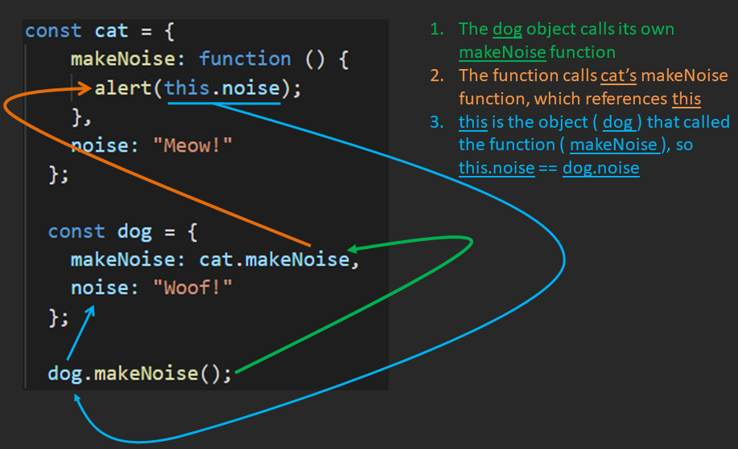

# A Definition

In JavaScipt, the keyword `this` refers to **the object that called (invoked) the function.**

  

Let's see this with an example. Copy the following into your console:
```js
const counter = {
  count: 0,

  updateCounter: function () {
    this.count += 1;
  }
};

counter.updateCounter();
counter.updateCounter();
counter.updateCounter();

alert(counter.count);
```
  

In this example, `counter` invoked the `updateCounter` function.

The invocation increments `counter`'s `count` property. Inside the `updateCounter` method, the `this.count` is the same as the alerted `counter.count`

In other words, we can say `this===counter` (the object that invoked the function).


----------

  

Let's look at another example:

```js
const cat = {
  makeNoise: function () {
    alert(this.noise);
  },
  noise: "Meow!"
};

const dog = {
  makeNoise: cat.makeNoise,
  noise: "Woof!"
};

cat.makeNoise();
dog.makeNoise();
```
  

At first glance, you might think that "Meow!" will alert two times and "Woof!" will not alert at all. But let's break it down:

  

When `cat.makeNoise( )` is called, `this.noise` is the same thing as `cat.noise`

Then, when `dog.makeNoise( )` is called, `this` changes because it refers to **the object that called the function** - the `dog` object that called the `makeNoise` function.

Now it refers to `dog` instead of `cat`, therefore `this.noise` is the same as `dog.noise`

  

Here's a diagram to illustrate:


  

Here's another way to write it with the same result:
```js
const makeNoiseFunction = function () {
  alert(this.noise);
}

const cat = {
  makeNoise: makeNoiseFunction,
  noise: "Meow!"
};

const dog = {
  makeNoise: makeNoiseFunction,
  noise: "Woof!"
};

cat.makeNoise();
dog.makeNoise();
```
