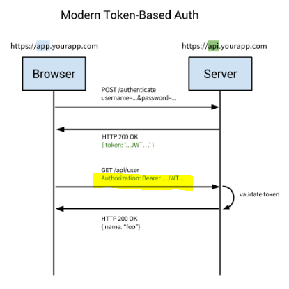
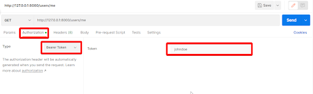

# Intro

The basic authentication scheme learned before is, as its name suggests, basic, and exposes both the username and the hashed password to attackers in each API call. A more modern security flow, instead of the *username/password* pair, and more secure concept, is a secure token called *authorization token’. The authorization token is an encoded string that is generated by the server. The client then stores this token and uses it in each subsequent request to be able to execute the authorized endpoints.

This token is referred to as the *Bearer token*, and is also known as *Bearer authentication* or *token authentication*, and has security tokens called bearer tokens. The name “Bearer authentication” can be understood as “give access to the bearer of this token.” The bearer token is a cryptic string, usually generated by the server in response to a login request. The client must send this token in the Authorization header when making requests to protected resources.

### Bearer authentication flow
Below is a simple flow of the Bearer authentication flow:
1. Client sends *username* and *password* to the server
1. Server creates a hashed token and sends it back to the client (the hashed token holds unique user information that allows the server to retrieve the relevant user)
1. The client then requests an API endpoint and includes the token
1. The server validates that the token is valid by decoding the token and retrieving the relevant user from the databases based on the ‘unique user information’ included in the token
1. The server then checks if the user is authorized to access the endpoint
1. If the server the the user is authorized, the endpoint returns the desired result with the 200 status code (successful)
1. Otherwise, the server will return a 401 unauthorized error



The main difference in this form of authorization is that the `Authorization` header contains a `Bearer` string and not a `Basic` string as in with the basic authentication.

### Examples of Bearer and Basic authentication tokens.
An example of a Bearer token is:
```Python
Authorization: Bearer $2a$12$CgpQ6EX4ukkKmTROa245OeplIB2kraEV6wuPJAM7G1gqX.Im.KBQC`
```

This tells the server that this is a token that includes multiple values that identifies a user and not just a ‘username’ and ‘password’ pair that exists in a Basic authentication scheme as follows:
```Python
Authorization: Basic $2a$12$CgpQ6EX4ukkKmTROa245OeplIB2kraEV6wuPJAM7G1gqX.Im.KBQC
```

If you’re using *Postman* to test your API endpoints, you need to select the `Bearer Token` from the *Type* field in the `Authorization` tab:

