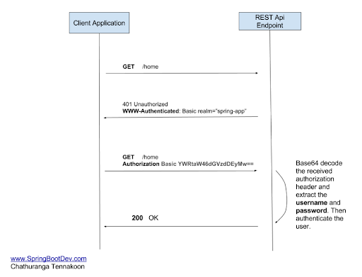
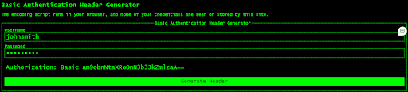
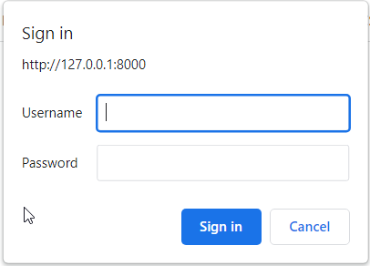

Now that we know how to use *dependency injections*, we’ll define a dependency function that will check for the user’s credentials, and will return the relevant response if 


### Adding basic authentication (Basic Auth)
We’ll use the built-in **FastAPI** `HTTPBasic` class which expects an authorization `header` with two encoded parameters, *username* and *password*. If this header exists it returns a header `WWW-Authenticate` with a value of `Basic`, and if they don’t, an `HTTP 401 "Unauthorized"` error is returned.



### Basic Auth and header credentials
We can’t simply send a *username* and a *password* as query parameters or header variables, we need to use the correct authentication syntax as part of the OpenAPI standard.

Essentially there should be only one header using the following syntax:
```Python
Authorization: Basic dG9tZXI6c3Nz
```

It’s made out of the:
- The word ‘Authorization: ‘ (a single space character after the colon symbol)
- The word ‘Basic ‘ (a single space character after the word)
- A Base64 encoded string

The Base64 is an encoding scheme that encodes binary data or strings into ____. 

Here is a link to generate the correct authorization header: 
[Basic Authentication Header Generator](https://www.debugbear.com/basic-auth-header-generator).




**Notes:**
- When an `Unauthorized` error is returned to the browser, it prompts the integrated *username* and *password* box
- The `credentials` parameter is of type `HTTPBasicCredentials` which stores the *username* and *password* variables
- In this example, we do not check if the *username* and *password* are valid, i.e. match pre-existing values on the server, we just want to see how the basic mechanism works

```Python
from fastapi import Depends, FastAPI
from fastapi.security import HTTPBasic, HTTPBasicCredentials
import uvicorn

app = FastAPI()
security = HTTPBasic()

@app.get("/profile")
async def main(credentials: HTTPBasicCredentials = Depends(security)):
    return {"name": "John Smith"}

if __name__ == "__main__":
    uvicorn.run("main:app", host="127.0.0.1", port=8000, log_level="info")
```

