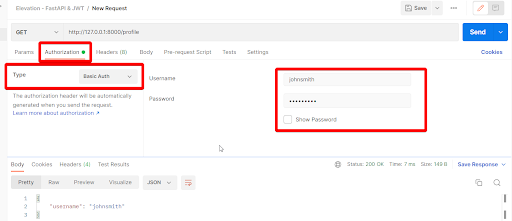

You can use a 3rd party tool to simulate RestAPI calls, and I recommend Postman. Using this tool you can use either the built-in *Authorization* tab, with the *Basic Auth* option selected.

Alternatively, you can use the *Headers* tab with a *Authorization* header and the value `Basic am9obnNtaXRoOnN3b3JkZmlzaA==` to authorize *johnsmith* and *swordfish*.
