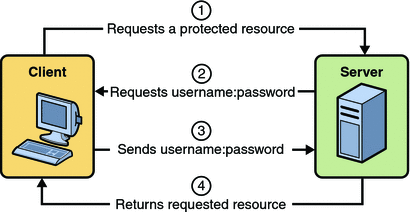

When we wish to secure a resource, a web page or an API endpoint, we would need to use some form of authentication, i.e. we need to check if someone is allowed to access a certain resource by matching some fields provided by the user to the same fields stored in the application’s database. These fields are called credentials.

The following illustration describes the 4 step process we normally encounter when we wish to implement the above use case. In this module, we will learn the basics of authentication, how to implement it using FastAPI, and how to make this process secure.

### Topics covered:
1. Understanding FastAPI dependencies
2. Building a simple FastAPI app with basic authentication