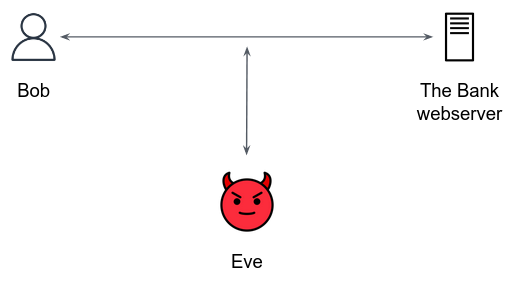

## The Motivation

In the previous page we discussed the TLS handshake. Let's take a closer look on the step when the server sends its public key to the client (step 1). 

Consider Eve who can listen and control the line between Bob and the Bank website. When the server sends the public key to Bob, Eve **keeps the bank's public key to himself and sends to Bob a forged public key instead**. Bob, innocently, encrypts the master key with Eve's public key, and sends it to the "Bank". Now Eve, as the real owner of the public key, is able to decrypt the message and discover the master key. 

How could the TLS Handshake gain **authenticity**? How could Bob verify the identity of the public key sent by the server?

## Digital certificates 

The TLS protocol authenticates servers with certificates signed by a trusted Certificate Authority (CA).

A **certificate**, simple put, is the server's **public key**, accompanied by some other **attributes** such as Organization name, Locality, Country name etc...

The certificate is [signed](https://en.wikipedia.org/wiki/Digital_signature) by **Certificate Authority**, an entity that stores, signs, and issues digital certificates. CA acts as a trusted 3rd party both by the client and the server. 

Common CA are [DigiCert](https://en.wikipedia.org/wiki/DigiCert), [Let's Encrypt](https://en.wikipedia.org/wiki/Let%27s_Encrypt) and the public cloud providers.

Returning to the Handshake process described in the previous page, when the client receives the public key of the server, she is actually receiving a certificate and can verify its authenticity with the trusted CA. 

---

To summarize how client and server can form a secure communication:

- **Privacy (encryption)** was achieved by securely exchanging a master-key between the client and the server, then using it in common symmetric encryption algorithms. 
- **Integrity** was achieved by the same above mentioned master-key, then using common data integrity algorithms. 
- **Authenticity** was achieved by Digital Certificates.