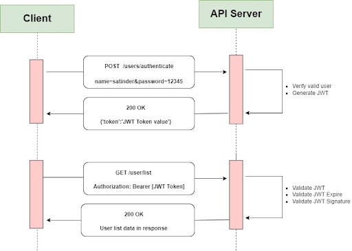

JSON Web Token (JWT) is an open standard that defines a compact and self-contained way for securely transmitting information between parties as a JSON object. This information can be verified and trusted because it is digitally signed.

JWT is a token authentication scheme using the `Authentication: Bearer {token}` syntax.

Below is a schematic flow of the client-server JWT communications. 
