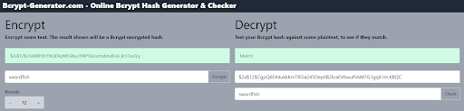

There are many hashing algorithms out there, such as: MD-5, PBKDF2, RIPEMD-160, Whirlpool, SHA1, SHA256, and others. The SHAx family of algorithms has been considered standard in recent years and the latest release is SHA3 and its derivatives, SHA3-256, SHA3-512 etc. [Here you can find a comparison of all SHA versions](https://en.wikipedia.org/wiki/Secure_Hash_Algorithms) (Wikipedia).

The SHAx family of hash functions is also considered *fast* hashes, and for password protection, it’s best to use *slow* hashes, such as BCrypt with iterative hashing to reduce the risk of attackers discovering the passwords in case there was a breach.

In this post, we are going to use the BCrypt algorithm. We will be using a super library `passlib`, to handle hashing and comparison for us. So, let's install `passlib` along with `Bcrypt`.

```Python
pip install "passlib[bcrypt]"
```

Now let’s extend the previous project to simulate the storage of users in a ‘temporary’ database (just a simple dictionary), but the passwords are hashed.

For the purpose of this project we will auto-create a hashed password and place it in the temporary ‘database’. We will use [Bcrypt-generator.com](https://bcrypt-generator.com/) to generate a hash for our ‘swordfish’ password. We will then compare the hashes to conclude if the passwords match. You can use the Bcrypt-generator to simulate hash comparison.



We implement a couple of new concepts outlined below:
- `users_db` - a simple dictionary to hold our ‘fake’ database of users
- `CryptContext` - a Class that defines the encryption method, in our case ‘bcrypt’
- `BaseModel` - a base Class used for creating ‘model’ classes, as part of the MVC design pattern. We’ll use this model as a data structure to return to the user at the end of the call

```Python
from typing import Union
from fastapi import Depends, FastAPI, HTTPException, status
from fastapi.security import HTTPBasic, HTTPBasicCredentials
from passlib.context import CryptContext
import uvicorn
from pydantic import BaseModel

app = FastAPI()
security = HTTPBasic()
pwd_context = CryptContext(schemes=["bcrypt"], deprecated="auto")

# Fake user db containing a single user with a hashed password
users_db = {
    "johnsmith": {
        "username": "johnsmith",
        "full_name": "John Smith",
        "email": "johnsmith@example.com",
        "hashed_password": "$2a$12$CgpQ6EX4ukkKmTROa245OeplIB2kraEV6wuPJAM7G1gqX.Im.KBQC"
    }
}

class User(BaseModel):
    username: str
    email: Union[str, None] = None
    full_name: Union[str, None] = None

# Function that authenticates the user
def authenticate_user(credentials: HTTPBasicCredentials = Depends(security)):
    is_authorized = True

    # First check if the username exists in the users db and if the password was provided
    if credentials.username not in users_db or not credentials.password:
        is_authorized = False

    # Secondly, check if the provided password matches the stored hashed password
    elif not pwd_context.verify(credentials.password, users_db[credentials.username]["hashed_password"]):
        is_authorized = False

    if not is_authorized:
        raise HTTPException(
            status_code=status.HTTP_401_UNAUTHORIZED,
            detail="Incorrect email or password",
            headers={"WWW-Authenticate": "Basic"},
        )

    # Populate a 'User' object with the database results, except for the hashed password
    return User(**users_db[credentials.username])

@app.get("/profile")
async def main(user: User = Depends(authenticate_user)):
    return user

if __name__ == "__main__":
    uvicorn.run("main:app", host="127.0.0.1", port=8000, log_level="info")
```
