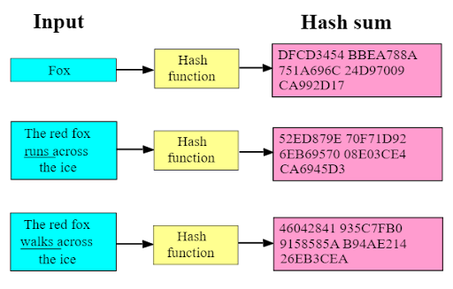

Storing raw passwords is super dangerous. In case our db is compromised for whatsoever reason. All our user's passwords will be available to the hacker without any effort. To tackle this scenario we make use of password hashing.

In very simple words, It is a one-way algorithm to convert passwords to a string that looks like gibberish e.g. If your password is "HelloWorld" it would become `$2y$12$kbQm9Vb96023efZFhSkZf.a4bAGyzDW6zKC/K1JDtKY0f.gKZxAHO` with 12 cryptographic iterations.

The wonderful thing about hashing is that we do not de-hash but we compare hashes to see if the password entered is the same as that of the existing password.

In this lesson we will learn:
- How to hash passwords
- How to integrate password hashing into your FastAPI security scheme
