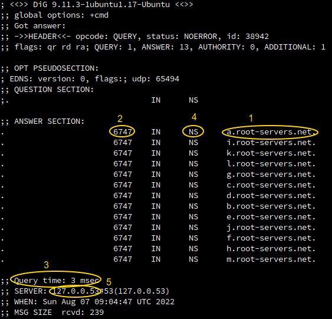

## Resolving google.com

We will resolve google.com step by step using the `dig` Linux command. 

### Get the root-level DNS

First, we want to get the list of the root-level DNS servers. Simply put `dig` in the Terminal panel to get it.
 
1. What is the first returned root-level DNS hostname?
2. What is the query TTL? (execute the command again and watch the TTL count-down)
3. How many time did it take to resolve the query?
4. What is the returned records type? 
5. Who is the server did you communicate with in order to get the root-level DNS list? [How](https://unix.stackexchange.com/questions/612416/why-does-etc-resolv-conf-point-at-127-0-0-53) can this server have a private IP address? 

  

     Solution
  

    

### Get the top-level domain of .com

Pick one of the root-level domain names. We will query this server to get the hostname of the *.com* top-level domain by:

`dig com @<your-chosen-root-level-hostname>`

  

     Solution
  

`dig com @e.root-servers.net.`

\
What are the three returned record types? 

  

     Solution
  

- NS for mapping com. to the hostname of a TLD server.
- A for mapping TLD hostname to IP address.
- AAAA for mapping TLD hostname to IPv6 address.

\
Can you confirm that these records were served from an external server? what is the public IP of this server? 

### Get the authoritative DNS server address of *google.com*

Now that we have a list of *.com* TLD servers, pick on of them to query the hostname of the authoritative DNS of *google.com*

  

     Solution
  

`dig google.com @a.gtld-servers.net.`

or 

`dig NS google.com`

\
How many different authoritative DNS servers does Google manage? 

  

     Solution
  

4 authoritative servers: 

ns2.google.com.
ns1.google.com.
ns3.google.com.
ns4.google.com.

### Get the IP address of *google.com*

Finally, as we know the hostname of the authoritative DNS servers of *google.com*, we can query one of them to retrieve the IP address of *google.com*. Let's do it.

  

     Solution
  

`dig google.com @ns2.google.com.`

or 

`dig A google.com`

\
Try to query the same record. Does your local DNS server take advantage of caching similar to web requests?

\
Try to access *google.com* using the returned IP address.