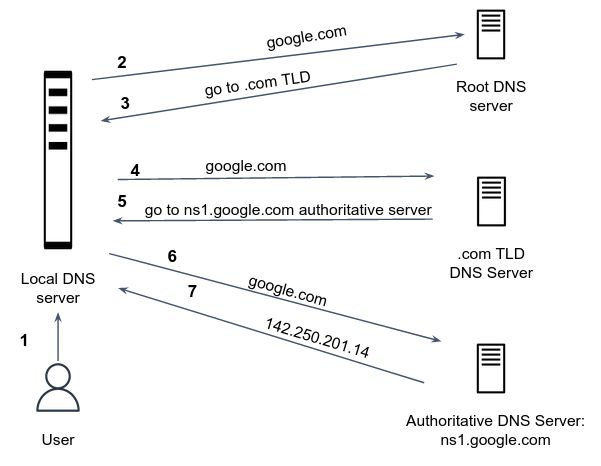

A simple design for the DNS service would have one DNS server that contains all the mappings. In this **centralized** design, clients simply direct all queries to the single DNS server, and the DNS server responds directly to the querying clients. Although the simplicity of this design is attractive, it is inappropriate for today’s internet. The problems with a centralized design include:

- The centralized server is a single point of failure.
- One server serves large traffic volume.
- Large latency for distant clients.
- Geo-political conflicts, as the country that will host the service can leverage this advantage for political interests. 

In fact, the DNS is a wonderful example of how a **distributed** database can be implemented in the internet.

In order to deal with the issue of scale, the DNS uses a large number of servers, organized in a hierarchical fashion and distributed around the world.

Let’s take a look at the overall process:

- A user opens a web browser and type *google.com*.

- The request is routed to a **local DNS server** , which is typically managed by the user's internet service provider (ISP). 

- The local DNS server forwards the request for *google.com* to a **DNS root name server**. There are 13 root DNS servers [around the world](https://en.wikipedia.org/wiki/Root_name_server). Since we want to resolve *google.com*, the server responds to clients requests by returning a list of the appropriate servers for all domains ending with *.com*. Those kind of DNS servers are called **top-level domain (TLD)**. Every TLD server has a domain extension (.com, .uk, .il, .ac, etc...) under their responsibility, they are listed [here](https://www.iana.org/domains/root/db). 

- The local DNS server forwards the request for *google.com* again, this time to one of the TLD name servers for *.com* domains. The TLD server responds to clients requests by returning a list of the **Authoritative DNS server**.

- The local DNS server forwards the request for *google.com* to the Authoritative DNS server. The server responds with a mapping between the host name *google.com* to the desired IP address of Google's server. The local DNS server finally has the IP address that the user needs. The server returns that value to the web browser.

- The web browser sends a request for *google.com* to the IP address that it got from the local DNS server. 

|||info
The local DNS server also caches the IP address for google.com for (short) amount of time, so that it can respond more quickly the next time someone browses to *google.com*. This mechanism is called query TTL (time to live).
|||

|||info
Every organization with publicly accessible website is responsible for its own authoritative DNS server. The server must provide the DNS records that map its domain name to IP addresses. The organization can choose to deploy and maintain the DNS server on its own, or, alternatively, to pay to a 3rd party to have these DNS records stored in an authoritative DNS server of some service provider. Most universities and large companies implement and maintain their own primary and secondary (backup) authoritative DNS server.
|||

