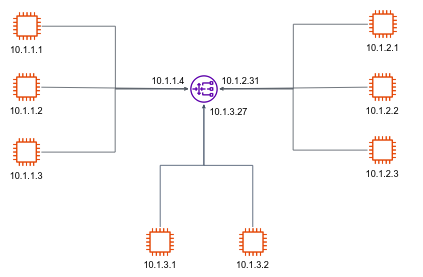

##  IP address and Port

In the Internet, every end system has an address called an IP address. When a source end system wants to send a packet to a destination end system, the source includes the destination’s IP address in the packet’s header. 

An IP address consists of **four bytes** and has a rigid hierarchical structure. An IP address looks like *121.7.106.83*, where each period separates one of the bytes expressed in decimal notation from 0 to 255. The binary representation of the above IP address is a 32-bit, as follows:

```text
  121       7       106       83
   |        |        |        |
01111001 00000111 01101010 01010011
```

In addition to knowing the address of the host to which a packet is destined, the sending program must also identify the receiving program **within** the host. This because a single host can run multiple different programs that use the Internet. A destination **port number** serves this purpose. Popular applications have been assigned [specific port numbers](https://en.wikipedia.org/wiki/List_of_TCP_and_UDP_port_numbers). Here are some:

| Description | Port  |
|---------|----------|
| FTP | 21  |
| SSH | 22  |
| HTTP | 80  |
| HTTPS | 443  |
| DNS | 53  |


## Subnets

We will now introduce the concept of subnet. If real life, IP addresses cannot be chosen in a completely random manner. Instead, a portion of an IP address (the prefix) will be determined by the network to which the host is connected.

Consider the following network diagram:



Particularly, take a close look on the three hosts in the upper left side. This network interconnecting three host interfaces and one router interface forms a **subnet**. We will denote this subnet as **10.1.1.0/24**. The subnet 10.1.1.0/24 thus consists of the 3 hosts (10.1.1.1, 10.1.1.2, and 10.1.1.3) and one router interface (10.1.1.4).

The /24 notation, sometimes known as a **[CIDR subnet mask](https://en.wikipedia.org/wiki/Classless_Inter-Domain_Routing)**, indicates that the leftmost 24 bits of the 32-bit IP address is static and define the subnet address. Any additional hosts attached to the 10.1.1.0/24 subnet would be required to have an address of the form 10.1.1.xxx, since the first 24 bits are always the same, the only quantity that can change is the rest 8 bits. 

There are two additional subnets shown: the 10.1.2.0/24 and the 10.1.3.0/24 subnets.

## Private address space

As defined in [RFC 1918](https://www.rfc-editor.org/rfc/rfc1918.html), the Internet Assigned Numbers Authority (IANA) has reserved the following three blocks of the IP address space for private internets:

- 10.0.0.0/8
- 172.16.0.0/12
- 192.168.0.0/16

This means, **public** servers can not have their IP address from the above spaces. Thus, those address space can thus be used by many organizations for internal networks communication. Addresses within this private address space will only be unique within the organization.


## Firewall

A firewall is a combination of hardware and software that isolates a subnet from the Internet, allowing some packets to pass and blocking others. A firewall allows a network administrator to control access between the outside world and resources within the administered network by specifying the subnet IP and subnet mask which allows to communicate with the network, as well as protocol and port number (if applicable). 

Here is an example of firewall rules table:


| action | source addr  | destination addr | protocol  |  port  | 
|---------|----------|----------|----------|----------|
| deny | all  | all  | all  | all  |
| allow | 10.1.3.0/24  | 10.1.2.0/24  | HTTP  | 80  |
| allow | 10.1.3.0/24  | 10.1.1.0/24  | TCP  | 5432  |
| allow | 0.0.0.0/0  | 10.1.3.0/24  | *  | *  |

The first rule in the firewall table is denying all kind of incoming traffic by default. 
The next rule, for example, allows HTTP traffic from host in the bottom center subnet (10.1.3.0/24), to any host in the top right subnet (10.1.2.0/24). 

Now what does the last rule allow? the source address (0.0.0.0/0) is often called the quad-zero route. The subnet mask is given as /0, which effectively specifies all networks. Hence in this rule we allow all kind of traffic (all protocols and ports) from the public Internet into the bottom subnet (10.1.3.0/24). This is the most loose firewall rule. 