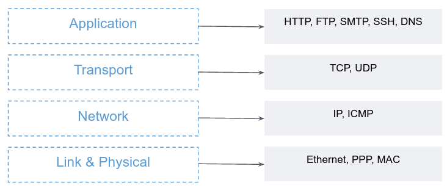

# Layered Architecture

The Public Internet is an *extremely* complicated system. This chapter introduces the OSI layer model to help you understand what happen to a piece of data while it is being transferred between two hosts over the Internet. 


In order to get data over a given network, lots of different hard- and software components needs to work together. **Network Protocol** is a set of rules for those components to communicate with each other. To provide structure to the design of network protocols, network designers organize protocols — and the network hardware and software that implement the protocols - in **layers**.

All these different types of communication protocols are classified in 7 layers, which are known as the **Open Systems Interconnection Reference Model**, the OSI Model for short. For easy understanding, this model is reduced to a 4-layer protocol description, as described in the table below:

| Layer Name | Protocol used in this layer  |
|---------|----------|
| Application Layer | HTTP, DNS, SMTP, SSH  |
| Transport Layer | TCP, UDP  |
| Network Layer | IP, ICMP  |
| Link and Physical Layer | Ethernet  |

Each layer can only use the functionality of the layer below, each layer can only export functionality to the layer above.

We will review the 4 layers by an example, from top to bottom. 
What happen when you open your web browser and type http://www.google.com? We will try to examine it in the prism of the OSI model.

**Application Layer**
The browser uses HTTP protocol to form a request to Google's servers, to serve Google home page. The HTTP request message may look like:
```
GET / HTTP/1.1
Host: google.com
User-Agent: Mozilla/5.0
```

We literally want to transfer this text to Google's servers over the Internet, their server already knows how to response to this to kind of messages. 
Since the web browser is an application that uses the network, it resides in the application-layer.

The application layer is where network applications and their application-layer protocols reside. Network applications may be Web browsers, mails, WhatsUp, and every application that send or receive data over the Internet.


**Transport Layer**
Continuing the above example, the HTTP text message is transferred to another software in the user operation system. This software can transport application-layer messages using TCP protocol. TCP breaks long messages into shorter **segments**, it guarantees that the data was indeed delivered to the destination and controls the order in which segments are being passed. Note that TCP only controls **how** the data is being sent and received, but it does not responsible for the actual sending of the data. 

The transport layer controls the transportation of application-layer messages between application endpoints.

**Network Layer**
The IP protocol is responsible for moving the TCP segments from one host to another. Just as you would give the postal service a letter with a destination address, IP protocol sends piece of data (a.k.a **packets**) to address (a.k.a **IP addresses**). It does so by communicating with a computer network devices (either physical or virtual) over a **Network Interfaces**.

The network layer routes packets through a series of routers between the source and destination hosts.

**Link and Physical Layers**
To move a packet from one **node** (host or router) to the next node in the route, the network layer relies on the services of the link and physical layers. In particular, at each node, the network layer passes the packet down to the link layer, which is a physical device (for example, Ethernet or WiFi interface cards). The network device delivers the packet to the next node along the route. This can be achieved over a wired or wireless electrical equipment.


